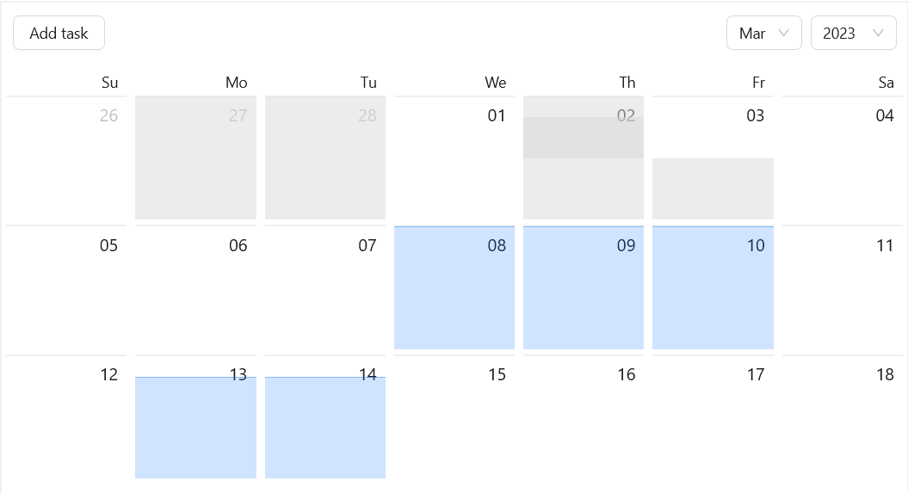

# workload

Visualization of current tasks with Ant design (antd, ant.design) calendar, Vite and Cloud Firestore (Firebase).

### First start

- https://firebase.google.com/docs/hosting/quickstart

### Deploy hosting/database/storage changes to existing firebase project

- https://firebase.google.com/docs/hosting/test-preview-deploy (firebase deploy --only hosting)

###### by TARGET_NAME

- https://firebase.google.com/docs/cli/targets

### Firebase read-write rules

- https://firebase.google.com/docs/rules
- in a write operation: **request.resource** (eg request.resource.data.secret, where _secret_ - one of the data from setDoc() function) refers to the document as it'll exist after the operation (if the operation succeeds), while **resource** (eg resource.data.secret) refers to the document as it exists before the operation (eg if document _updated_, not _created_ in this operation).
